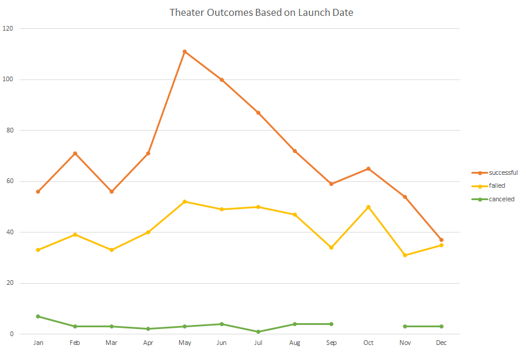
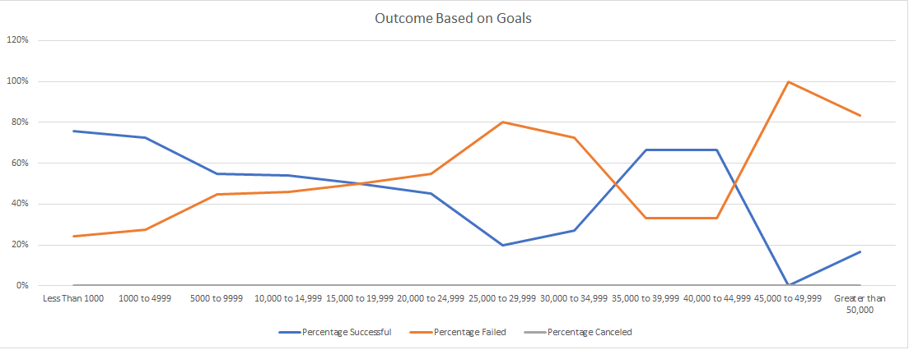

# Kickstarting with Excel

## Overview of Project

### Purpose

The purpose of this project is to analyse Kickstarter data in order to help our friend Ann set up her own Kickstarter campaign so that it is more likely to be successful. We will be analysing existing Kickstarter campaigns outcomes based on their start dates and goals. 

## Analysis and Challenges

### Analysis of Outcomes Based on Launch Date

Based on the existing data we created a pivot table that allowed us to filter each of the categories: failed, successful, and canceled based on the month of the year the campaign was started. We filtered this even further to only include the subcategory of theather since this is the information that most closely resembles the campaign Ann is looking for information on.
Here are the results from when we analysed the outcome of the theater Kickstarter campaigns based on launch date:

### Analysis of Outcomes Based on Goals

In order to analyse the data based on goals we had to do some further excel manipulation. First we had to separate the goals into ranges that would allow us to look at segments of the data. The ranges we chose were less that $1000, $1000 - $4999, then $5000 segments until everything over $50000 was grouped together. At this point we were able to use the countifs() formula in excel to allow us to break down that data based on the outcome of the campaign and the subcategory plays, again because this information would be most useful to Ann. For example theformula that allowed us to get the counts of successful campaigns with a goal of $1000 - $4999 for the category of plays is:
>=COUNTIFS(Kickstarter!$D:$D, ">=1000", Kickstarter!$F:$F, "successful", Kickstarter!$R:$R, "plays", Kickstarter!$D:$D, "<=4999", Kickstarter!$F:$F, "successful", Kickstarter!$R:$R, "plays")

Here are the results from when we analysed the outcome of the kickstarter based on their goal:

### Challenges and Difficulties Encountered

## Results

- What are two conclusions you can draw about the Outcomes based on Launch Date?

- What can you conclude about the Outcomes based on Goals?

- What are some limitations of this dataset?

- What are some other possible tables and/or graphs that we could create?
